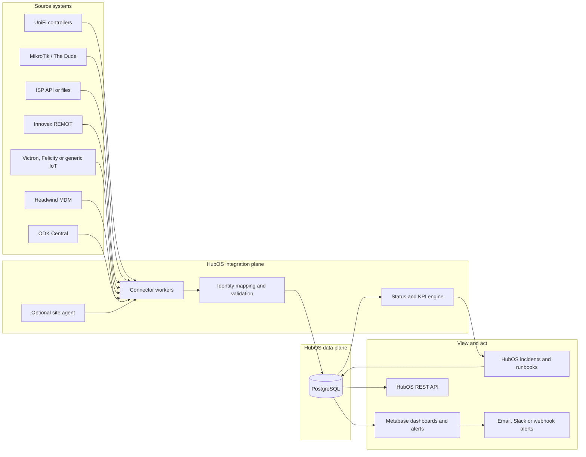
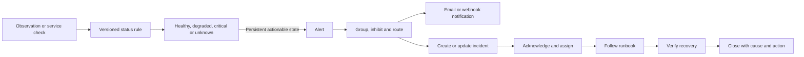

# HubOS Pilot-Ready Technical Design

**Product:** HubOS  
**Programme:** Project Hello World  
**Document status:** Proposed implementation baseline  
**Reference deployment:** Ten schools - five in Uganda and five in Angola  
**Primary purpose:** Monitor and support school connectivity  
**Deployment model:** Open-source, self-hosted, modular Docker Compose stack  
**Last updated:** 16 July 2026

---

## 1. Executive summary

HubOS is an open-source operations and evidence layer for school connectivity. It brings together data that already exists in network controllers, routers, solar monitoring systems, managed devices, ISP records, field forms, and maintenance workflows. It converts that data into a shared view of whether each school is connected, powered, observable, and receiving support.

The first reference deployment covers ten schools across Uganda and Angola. Its purpose is operational feasibility: demonstrating that a small technical team can detect problems earlier, understand their likely cause, route them to the right person, and measure whether service was restored.

HubOS is not a new router controller, solar platform, MDM, survey tool, or learning platform. It connects to those tools through replaceable adapters. The product-owned code is intentionally limited to the functions that make the separate systems work together:

- canonical school, hub, asset, and external-identifier mapping;
- connector scheduling, normalisation, retries, and backfill;
- common operational status and KPI calculation;
- alert-to-incident workflows;
- a stable REST API;
- dashboards, deployment configuration, tests, and runbooks.

The system is packaged as modular Docker Compose projects. A partner can deploy only the core monitoring services, add ODK or Headwind MDM, enable a generic IoT platform, or connect existing hosted systems. This avoids forcing every deployment into one large and fragile software bundle.

---

## 2. Product definition

### 2.1 Product statement

HubOS helps schools and the organisations that support them answer four questions:

1. Is the school connected?
2. Does the connectivity system have stable power?
3. Are the devices and services usable?
4. When something goes wrong, is somebody acting on it?

### 2.2 Primary users

- School and Hub operators who need a simple view of current status and required action.
- Country operations teams responsible for multiple schools and service providers.
- Technical teams supporting routers, power systems, managed devices, and integrations.
- Programme and MEL teams combining operational evidence with ODK data.
- Governments, implementing partners, and funders reviewing agreed service indicators.
- Open-source contributors building new connectors, dashboards, and deployment profiles.

### 2.3 Goals

- Provide one operational view across heterogeneous school infrastructure.
- Support multiple organisations, countries, controllers, ISPs, and hardware vendors.
- Detect power, network, device, and data-collection problems early.
- Connect every alert to an owner, response, resolution, and learning record.
- Operate with intermittent site connectivity and delayed source data.
- Minimise collection of identifiable user information.
- Make deployment reproducible with open-source components and Docker Compose.
- Offer both self-hosted and future managed-service deployment models.
- Publish stable data models and APIs for external integrations such as Giga or EMIS platforms.

### 2.4 Non-goals for the first release

- Replacing UniFi, MikroTik, Innovex REMOT, Victron, Headwind MDM, or ODK.
- Building a complete network controller or solar hardware management platform.
- Tracking identifiable browsing histories or individual learner behaviour.
- Claiming educational impact from operational telemetry.
- Automating high-risk changes to routers, power systems, or managed devices.
- Delivering a complete voucher-payment or billing system in the monitoring MVP.
- Supporting national-scale infrastructure before the reference architecture is validated.

---

## 3. Reference deployment and expansion model

The reference deployment comprises:

- five schools in Uganda;
- five schools in Angola;
- one or more UniFi controllers;
- one or more MikroTik environments;
- Innovex REMOT solar telemetry where installed;
- optional Victron, Felicity, or generic IoT telemetry;
- Headwind MDM for managed Android devices;
- ODK Central for inspections, incidents, training, and programme data;
- ISP APIs or files with usage and service information.

The design does not assume that all schools use the same equipment or controller. Each source connection belongs to an organisation and may cover one school, a country group, or an entire partner fleet.

The same architecture can expand from ten schools to larger programmes by adding connector workers, partitioning telemetry data, separating partner databases where required, and moving from Docker Compose to an orchestrated environment. These are scaling options, not requirements for the reference deployment.

---

## 4. Architecture decisions

| Decision | Selected direction | Reason |
|---|---|---|
| Product boundary | Open-source orchestration, monitoring, data, and action layer | Keeps vendor systems replaceable and limits custom code |
| Deployment | Modular Docker Compose projects and profiles | Reproducible locally and on a partner-managed server |
| Canonical store | PostgreSQL | Supports relational registry, telemetry, incidents, KPI models, and BI without a second database at pilot scale |
| Operational evidence | PostgreSQL status, telemetry, connector health, and incident history | Keeps the first deployment observable through one auditable data store |
| Dashboards and alerts | Metabase by default | Provides operational and MEL dashboards plus question-based email, Slack, and webhook alerts with a smaller stack |
| Field data | ODK Central | Existing programme tool with offline-capable forms |
| Device management | Headwind MDM connector and optional deployment profile | Keeps MDM authoritative while exposing operational device indicators |
| Solar source | Innovex REMOT connector first | A documented API exposes devices, current readings, historical records, and notifications |
| Generic IoT | Optional ThingsBoard Community Edition profile | Apache-licensed server and gateway, Docker support, common IoT protocols, rule engine, and alarms |
| Thinger.io | Optional external connector/evaluation target | Useful APIs and device support, but current on-premise deployment requires a licensed private instance |
| Access control | FreeRADIUS 3 with optional OpenWISP Radius/login pages | Open AAA foundation; enforcement remains with the router or network access server |
| HubOS API | Vanilla JavaScript service on Bun | Keeps all HubOS custom runtime code in the selected JavaScript stack |
| Operator console | Vanilla HTML, CSS, and JavaScript delivered by the Bun service | Provides mappings, connector health, acknowledgement, assignment, and incident closure without a frontend framework |
| Background work | Bun worker using PostgreSQL-backed jobs and leases | Provides scheduled pulls, retries, and restart recovery without a separate HubOS message broker |
| Reverse proxy | Caddy | Simple local and production routing with automatic HTTPS when enabled |
| Identity | OIDC-compatible integration; optional Keycloak profile | Allows partners to bring an identity provider without coupling core services to one product |

Every release must include a software bill of materials and verify component licences. External proprietary systems may be connected, but the HubOS-owned code and required core deployment must remain under approved open-source licences.

---

## 5. Logical architecture

### 5.1 Four operating planes

HubOS separates four concerns that are often mixed together:

1. **Source plane:** network, energy, device, ISP, and field systems.
2. **Integration plane:** connectors, site agents, mapping, validation, retries, and normalisation.
3. **Operations plane:** current status, alerts, incidents, runbooks, and maintenance actions.
4. **Evidence plane:** KPI models, trends, ODK results, reports, and external APIs.



### 5.2 Collection modes

Each source connection uses one of three modes.

#### Mode A - cloud or hosted API pull

The central worker calls a hosted source such as Innovex REMOT, Headwind MDM, Victron VRM, a cloud UniFi service, or an ISP API. This is the preferred mode when the provider offers a stable API.

#### Mode B - controller pull

The central worker connects to a partner-managed controller through a restricted network path such as a VPN. This supports local UniFi controllers, MikroTik RouterOS APIs, The Dude, and other management systems.

#### Mode C - site-agent push

A lightweight agent runs at the school or within the partner's controller network. It reads local APIs or SNMP, performs connectivity probes, buffers data in SQLite, and posts signed batches to HubOS. This mode is required when devices sit behind NAT, are not safely reachable centrally, or must continue measuring during upstream outages.

The central platform must never require direct public exposure of router administration or SNMP ports.

---

## 6. Docker Compose packaging

### 6.1 Packaging principle

HubOS should not place every supported product in one monolithic Compose file. ODK Central, Headwind MDM, and IoT platforms have their own release cycles and internal dependencies. HubOS should provide a root deployment manifest and tested Compose overlays that share controlled networks, domains, secrets, and backups.

### 6.2 Deployment profiles

| Profile | Services | Required? |
|---|---|---|
| `core` | Caddy, Bun HubOS API and vanilla-JavaScript console, Bun connector worker, Dbmate migrations, PostgreSQL jobs and data | Yes |
| `analytics-metabase` | Metabase dashboards, alerts, subscriptions, and idempotent first-run HubOS database bootstrap | Yes for the reference deployment |
| `dev` | Mailpit, seeded demo data, mock source APIs | Local development only |
| `identity` | Keycloak or another OIDC provider configuration | Optional |
| `odk` | Pinned official ODK Central Compose application and HubOS connector | Included in version 1; optional to run when an external ODK already exists |
| `mdm` | Pinned official Headwind MDM Compose application and HubOS connector | Included in version 1; optional to run when an external Headwind already exists |
| `iot` | ThingsBoard CE and, where required, ThingsBoard Gateway | Optional |
| `access` | FreeRADIUS 3, OpenWISP Radius/login pages, test NAS | Optional |
| `edge` | HubOS site agent, local probe configuration, SQLite spool | Optional per site |

### 6.3 Version 1 repository structure

```text
hubos/
├── README.md
├── compose.yaml
├── compose/
│   ├── mel.compose.yaml
│   ├── development.compose.yaml
│   ├── ecosystem.compose.yaml
│   └── headwind.hubos.override.yaml
├── db/
│   └── migrations/
├── services/
│   └── hubos/
│       ├── public/
│       ├── src/
│       │   ├── connectors/
│       │   ├── connector-runtime/
│       │   └── store/
│       └── test/
├── runbooks/
├── docs/
├── scripts/
└── vendor/                 # pinned upstream projects, fetched locally
```

### 6.4 Configuration rules

- Provide `.env.example` files with no working credentials.
- Use Docker secrets or mounted secret files in production.
- Pin container versions and record image digests in release manifests.
- Keep partner-specific configuration outside the public repository.
- Validate configuration before services start.
- Include database migrations and rollback notes with every release.
- Provide ARM64 and AMD64 compatibility where upstream images permit it.
- Generate an SBOM and container-vulnerability report for release candidates.

### 6.5 Reference resource envelope

Resource values are planning assumptions and must be verified by load testing with the enabled profiles.

| Environment | Initial planning envelope | Notes |
|---|---|---|
| Developer laptop | 4 CPU cores, 8 GB RAM, 50 GB free storage | Run mock sources and only the profiles under active development |
| Ten-school core reference server | 4 vCPU, 8 GB RAM, 100 GB SSD | Core and Metabase without locally hosted ODK, Headwind, or an IoT platform |
| Ten-school full reference server | 8 vCPU, 16 GB RAM, 250 GB SSD | Allows optional ODK, Headwind, or IoT profiles; split heavy profiles if resource contention appears |
| Lightweight site agent | 1 CPU core, 512 MB RAM, 2 GB durable storage | Actual requirement depends on local probes, buffering period, and hardware architecture |

Only Caddy exposes the HubOS HTTP service. PostgreSQL, connector workers, source adapters, and administration paths remain on internal networks or restricted management paths. Metabase, ODK, and Headwind publish explicit ports only when their deployment layers are enabled.

Telemetry storage must be estimated before deployment:

```text
storage = sites x metrics x samples_per_day x retention_days
          x average_record_size x index_and_backup_overhead
```

The production design must reserve capacity for database indexes, write-ahead logs, connector quarantine records, backups, dashboards, ODK attachments, and container logs. Alerts should be configured for disk capacity and backup age.

---

## 7. Canonical identity and data model

### 7.1 Identifier strategy

HubOS issues its own immutable UUID for every organisation, site, hub, asset, service, and connection. External identifiers are never used as primary keys.

For example, one school may be known as:

- a UniFi site ID;
- a MikroTik system identity;
- an ISP subscriber account;
- an Innovex device serial;
- a Headwind configuration or device group;
- an ODK school code;
- a partner spreadsheet reference.

All are mapped to one canonical `site_id` through `external_identifier` records.

### 7.2 Core entities

| Entity | Purpose |
|---|---|
| `organisation` | Partner, government, implementer, or hosted-service tenant |
| `country` | Country configuration and reporting scope |
| `site` | School or community location being monitored |
| `hub` | Connectivity installation at a site |
| `asset` | Router, AP, radio, modem, solar device, tablet, or server |
| `service` | WAN, Wi-Fi, local content, power, MDM, or another monitored service |
| `source_system` | Connector type such as UniFi, REMOT, or ODK |
| `source_connection` | One configured controller, API account, file source, or agent |
| `external_identifier` | Mapping from a source identifier to a canonical entity |
| `metric_definition` | Name, unit, type, valid range, aggregation, and privacy class |
| `observation` | Timestamped normalised measurement |
| `service_check` | Result of an explicit availability or quality probe |
| `status_snapshot` | Calculated current state and contributing evidence |
| `alert` | Rule violation or recovery event |
| `incident` | Actionable operational problem with ownership and lifecycle |
| `incident_event` | Acknowledgement, comment, assignment, escalation, or resolution |
| `maintenance_action` | Work performed, parts used, and result |
| `kpi_definition` | Version-controlled calculation and governance metadata |
| `kpi_result` | Calculated result for a site, group, and period |

### 7.3 External identifier record

Every mapping must store:

- organisation and source connection;
- canonical entity type and UUID;
- external identifier and optional external parent identifier;
- validity start and end;
- mapping method: manual, discovered, or imported;
- verification status and verifier;
- last successful observation time.

No telemetry is promoted to trusted reporting until its source identifiers are mapped or explicitly placed in a quarantine queue for review.

### 7.4 Observation envelope

All connector outputs use a common envelope:

```json
{
  "schema_version": "1.0",
  "organisation_id": "uuid",
  "site_id": "uuid",
  "asset_id": "uuid",
  "source_connection_id": "uuid",
  "external_record_id": "source-specific-id",
  "metric": "power.battery_voltage",
  "value": 25.4,
  "unit": "V",
  "observed_at": "2026-07-16T12:00:00Z",
  "received_at": "2026-07-16T12:01:05Z",
  "quality": "valid",
  "attributes": {
    "source_field": "battery_voltage"
  }
}
```

`observed_at` records when the condition occurred. `received_at` records when HubOS received it. Keeping both is essential for delayed synchronisation and accurate outage calculations.

---

## 8. Connector framework

### 8.1 Connector contract

Every Version 1 connector implements the same small runtime contract:

- `manifest` - declare connector identity, protocol version, collection modes, and capabilities;
- `validateConfig()` - verify required configuration without collecting data;
- `collect()` - retrieve source-shaped records for a mapped target;
- `normalize()` - translate those records into the versioned canonical envelope and status evidence;
- `health()` - report reachability and source freshness.

Connectors may later add discovery, inventory, historical cursors, and webhooks behind the same manifest. The shared runner—not the vendor package—owns job leasing, raw-payload evidence, external-identifier verification, idempotent writes, status updates, retries, and run history. A new source therefore extends the registry and connector package without changing the central architecture.

### 8.2 Connector behaviour

- Use read-only credentials wherever the source permits them.
- Respect rate-limit and pagination headers.
- Retry transient failures with bounded exponential backoff and jitter.
- Treat authentication and schema errors as non-retryable until corrected.
- Use idempotency keys based on source connection and external record ID or payload hash.
- Retain a restricted raw-payload reference for debugging without making raw payloads the reporting source.
- Quarantine invalid values rather than silently discarding them.
- Record connector version and mapping version on every ingestion batch.
- Backfill from the last committed cursor after an outage.
- Write connector health, last success, backlog, and run history to PostgreSQL so the operator console and Metabase can use the same evidence.

### 8.3 Innovex REMOT connector

The published REMOT Open API supports the required pilot use case:

| Capability | API pattern |
|---|---|
| List devices | `GET /api/v1/devices` |
| Device settings and inventory | `GET /api/v1/devices/{serial}` |
| Current reading | `GET /api/v1/devices/{serial}/last-record` |
| Historical readings | `GET /api/v1/devices/{serial}/records?from=...&to=...` |
| Notifications | `GET /api/v1/devices/{serial}/notifications?from=...&to=...` |

Authentication uses a bearer token. Historical responses are paginated and the documentation states that one response returns at most 3,000 records. Example response headers show rate-limit information; the connector must read those headers instead of assuming a fixed allowance.

The first normalised fields are:

- supply voltage and current;
- battery voltage;
- panel voltage and current;
- room and battery temperature;
- device status and last log time;
- system and component metadata where available;
- source notifications and priority.

Calculated power values must preserve provenance:

- `power.panel_watts = panel_voltage * panel_current`;
- `power.supply_watts = supply_voltage * supply_current`.

These are calculated estimates, not direct energy-meter readings. State of charge must not be inferred from voltage without a battery-specific model and configuration.

#### REMOT security action

The public Postman collection currently contains token-shaped collection variables. Their values must not be copied into code, tests, issues, or documentation. The API owner should remove them from the published collection and rotate any corresponding credentials before integration testing. HubOS must use a newly issued, scoped, read-only token.

### 8.4 Generic solar and IoT integration

HubOS should support two paths:

1. **Vendor API adapters** for REMOT, Victron VRM, or another documented cloud system.
2. **Generic telemetry ingestion** for locally integrated devices using MQTT, HTTPS, Modbus, SNMP, or a site agent.

ThingsBoard Community Edition is the recommended optional IoT profile because it is Apache 2.0 licensed, deploys with Docker, and supports common device protocols through its server and gateway. HubOS consumes normalised telemetry from its APIs or event flow rather than duplicating every device protocol in custom code.

OpenRemote is a viable alternative for partners that prefer its asset, rule, and multi-tenant model. Thinger.io can be connected through its API, but it is not the default self-hosted profile because its documented private on-premise deployment requires a licence. The adapter boundary allows any of these choices without changing the HubOS data model.

Felicity support depends on the interface exposed by the installed inverter or charge controller. If no supported cloud API exists, the preferred path is a read-only Modbus/RS-485 gateway or an approved telemetry device. Reverse-engineered or write-capable control integrations are outside the first release.

### 8.5 UniFi connector

The connector must support multiple source connections and both hosted and local controllers. It should use the official API available for the deployed UniFi Network version and collect only operationally necessary data:

- controller and site health;
- gateway, switch, and access-point status;
- WAN status and basic performance;
- client counts and aggregate traffic;
- device uptime, firmware, and last seen;
- AP radio health where available.

Per-client browsing histories are not ingested. Device addresses used for short-term troubleshooting must be irreversibly pseudonymised before storage or discarded after aggregation.

### 8.6 MikroTik connector

For RouterOS 7, the preferred integration order is:

1. secure RouterOS REST API for inventory and structured state;
2. SNMPv3 for standard counters and interface health;
3. The Dude as an optional source where it already centralises monitoring;
4. a site agent when routers are not reachable through a private management network.

The integration uses read-only credentials. HTTP RouterOS API access and SNMPv1/v2c are not acceptable for production. Write operations, reboots, configuration changes, and scripts require a separate future control-plane design and explicit approval.

### 8.7 ISP connector

The preferred source order is:

1. authenticated API;
2. scheduled CSV or JSON export;
3. validated spreadsheet import;
4. PDF extraction as a manual fallback.

The attached sample report provides monthly protocol traffic by subscriber. For June 2026 it contains approximately 127.5 GB received, 17.9 GB transmitted, and 145.4 GB total across the listed records. It does not provide uptime, outage duration, contracted capacity, latency, packet loss, or measured speed.

The canonical ISP import therefore includes:

- ISP and subscriber reference;
- mapped HubOS site;
- reporting period and source generation time;
- upload, download, and total bytes;
- contracted download and upload capacity, where supplied;
- availability and outage duration, where supplied;
- latency and packet loss, where supplied;
- data-quality and completeness status.

Protocol or application classifications are disabled by default because definitions vary between ISPs and may expose unnecessarily sensitive behaviour. They may be retained only as optional site-level aggregates under an approved data policy.

### 8.8 Headwind MDM connector

Headwind remains authoritative for device enrolment, policies, applications, and remote actions. HubOS consumes operational summaries such as:

- device and configuration identifiers;
- assigned site or group;
- last check-in;
- compliance or configuration state;
- operating-system version;
- storage or battery fields where exposed;
- active, offline, lost, or damaged operational classification.

The template must support an externally hosted Headwind instance and an optional local deployment profile. HubOS must not expose remote lock, wipe, or configuration actions in the first release.

### 8.9 ODK connector

ODK is used for evidence that cannot be observed automatically:

- installation and commissioning;
- site and asset verification;
- incident reports;
- maintenance actions;
- training and attendance;
- school feedback;
- operational baseline and endline checks.

ODK submissions link to HubOS through stable school and hub identifiers. Personally identifiable survey data remains in a restricted ODK/project data domain. HubOS receives only approved operational fields and aggregated MEL outputs.

---

## 9. Status model

Every monitored domain has one of five states:

| State | Meaning |
|---|---|
| `healthy` | Recent evidence is within the configured operating range |
| `degraded` | Service is available but quality or capacity is outside the preferred range |
| `critical` | Service is unavailable, unsafe, or below a configured critical threshold |
| `unknown` | Evidence is missing, stale, invalid, or contradictory |
| `maintenance` | A planned maintenance window suppresses normal incident creation |

The overall site status is calculated from domain statuses for:

- monitoring coverage;
- power;
- WAN connectivity;
- local network and Wi-Fi;
- managed devices;
- optional local services.

`unknown` must not be converted to `healthy`. Missing monitoring data is itself an operational condition.

Every status stores the rule version and the evidence that produced it, allowing a user to understand why HubOS classified a school in a particular way.

### 9.1 Usable-connectivity probe

Router or controller uptime alone is not sufficient evidence that a school can use the internet. Where a site agent can run, it performs a configurable probe bundle every five minutes:

- reach the local default gateway;
- resolve a controlled DNS name;
- complete an HTTPS request against at least two independently hosted probe targets;
- record request time and failure category;
- optionally measure packet loss where the network permits a reliable test.

The default usable-connectivity rule requires successful DNS resolution and at least one successful HTTPS target. Gateway, DNS, TLS, timeout, and upstream HTTP failures remain distinct diagnostic results. A deployment must control or approve the probe targets and ensure that the checks consume negligible bandwidth.

Central controller data and ISP data provide corroborating evidence but do not replace the site-perspective probe. When no site agent is available, HubOS labels availability as controller-observed or centrally observed rather than presenting it as direct school-experience evidence.

---

## 10. Alerting and incident management

### 10.1 Separation of concepts

- A **signal** is one observation or check.
- A **status** is a calculated condition over one or more signals.
- An **alert** is a rule transition that requires attention or records recovery.
- An **incident** is the human work item used to diagnose and resolve a service problem.

Repeated alerts for the same underlying problem must update one incident rather than create notification floods.

### 10.2 Alert flow



### 10.3 Initial configurable rules

| Condition | Provisional persistence | Severity | First action |
|---|---:|---|---|
| Site connectivity probe fails | 15 minutes | High | Check correlated power and controller status |
| WAN quality degraded | 30 minutes | Medium | Review latency, loss, load, and ISP state |
| Network controller data stale | 30 minutes | Medium | Check connector and controller reachability |
| All site telemetry missing | 60 minutes | High | Determine whether monitoring or the site is offline |
| Solar telemetry stale | 60 minutes | Medium | Check REMOT/device connectivity |
| Battery below site-specific warning threshold | 15 minutes | Medium | Check solar input, load, and local conditions |
| Battery below site-specific critical threshold | 10 minutes | High | Apply the power runbook and protect essential loads |
| Access point offline | 15 minutes | Medium or high | Check power, uplink, and controller state |
| Managed-device check-in stale | 24 hours | Low | Confirm charging, use schedule, and connectivity |
| Connector backlog exceeds policy | 30 minutes | Medium | Check rate limits, credentials, and source availability |

Power thresholds must be configured per battery chemistry and system design. They must not be global voltage constants.

### 10.4 Notification delivery

Version 1 uses Metabase questions, dashboard subscriptions, and alerts against the canonical and `analytics` schemas. The initial supported delivery methods are:

- email;
- Slack where the deployment configures it;
- webhooks where the selected Metabase workflow supports them.

SMS, WhatsApp, complex inhibition, and advanced on-call routing require external gateways or an optional later alert-routing service; they are not core dependencies. Local development routes Metabase email to Mailpit so alert content can be tested without sending external messages.

Each notification contains:

- school and country;
- affected service;
- start time and duration;
- severity and current evidence;
- likely correlated conditions;
- incident link;
- first safe action and runbook link;
- escalation contact or queue.

### 10.5 Incident lifecycle

`open -> acknowledged -> assigned -> investigating -> monitoring_recovery -> resolved -> closed`

An incident cannot be closed without:

- resolution category;
- responsible owner;
- recovery verification;
- action taken;
- whether a site visit or part was required.

Root cause is optional at initial closure and may be completed during later review.

---

## 11. Dashboards

### 11.1 School operations view

- Is the school online now?
- Is monitoring data fresh?
- Is the power system healthy?
- Are access points and managed devices reporting?
- What action is currently required?
- Who owns the open incident?

This view prioritises plain-language status and tasks over raw charts.

### 11.2 Country operations view

- map and fleet status for Uganda or Angola;
- schools offline, degraded, or unknown;
- open incidents by age and severity;
- ISP and controller performance;
- repeat failures;
- maintenance due and completed;
- data-quality exceptions.

### 11.3 Engineering view

- raw and normalised telemetry;
- connector freshness and backlog;
- network interface, latency, loss, and traffic trends;
- power voltage, current, calculated power, and temperature;
- rule evaluation evidence;
- firmware and configuration inventory;
- event correlation around an outage.

### 11.4 Programme and MEL view

- connectivity availability by school and country;
- monitoring coverage;
- incident response and restoration;
- device activity;
- school-hours usage;
- ODK operational checks and follow-up;
- maintenance burden and recurring causes.

### 11.5 Public or partner view

Only approved aggregate metrics are exposed. Infrastructure administration details, user-level data, credentials, and sensitive incident content are excluded.

---

## 12. KPI framework

The operational-feasibility question is: **Can HubOS provide trustworthy visibility and help teams restore school connectivity more effectively?**

### 12.1 Primary KPIs

#### KPI 1 - Visibility coverage

**Definition:** Percentage of expected school-domain intervals for which HubOS has fresh, valid evidence.

```text
valid observed site-domain intervals
------------------------------------ x 100
expected site-domain intervals
```

Domains are network, power, and devices. Results are shown separately by domain before any combined score is calculated.

**Why it matters:** A monitoring product cannot support a school it cannot see.

**Primary sources:** Connector health, observations, and service checks.

**Caveat:** High coverage does not mean the school is healthy; it means HubOS can make a supported determination.

#### KPI 2 - Usable connectivity availability

**Definition:** Percentage of eligible monitoring intervals in which the school's external connectivity check meets the deployment's minimum usable-service rule.

```text
intervals meeting the usable-service rule
------------------------------------------ x 100
eligible intervals with valid evidence
```

The rule includes successful reachability and may include configurable latency or loss limits. Planned maintenance is reported separately rather than silently removed.

**Why it matters:** It represents the service experienced by the school more directly than router uptime alone.

**Primary sources:** Site-agent or blackbox probes, router state, and controller data.

**Guardrail:** Report visibility coverage beside availability so missing evidence cannot inflate the result.

#### KPI 3 - Incident restoration performance

**Definition:** Median time from the start of a qualifying service incident to verified restoration, reported with the 75th and 90th percentiles.

**Why it matters:** HubOS is intended to lead to action, not merely produce dashboards.

**Primary sources:** Alerts, incident events, and recovery checks.

**Caveat:** Incident severity, dependency on an ISP, and required site travel must be shown as segments rather than mixed into one unexplained average.

### 12.2 Diagnostic metrics

- alert detection delay;
- time to acknowledge;
- percentage of incidents assigned to an owner;
- percentage of incidents with verified recovery;
- repeat incident rate within 30 days;
- connector success rate and backlog;
- data validation failure rate;
- WAN latency and packet loss;
- AP availability;
- active managed-device rate;
- solar telemetry freshness;
- maintenance actions completed;
- school-hours versus after-hours aggregate traffic.

### 12.3 Guardrails

- **False or non-actionable alert rate:** alerts closed without an operational condition or action.
- **Monitoring overhead:** traffic and compute used by monitoring at the school.
- **Privacy exposure:** count of rejected or quarantined fields that violate the approved data policy.
- **Manual workload:** time spent correcting mappings or imports.

### 12.4 Targets

Service-performance targets should be set after a baseline period because the ten schools may have different ISPs, power systems, and access conditions. The product itself can be accepted against engineering thresholds before programme targets are set.

---

## 13. Engineering acceptance criteria

A release is ready for a reference deployment when it passes the following tests.

### 13.1 Deployment

- A new technical user can start the documented local stack from a clean machine.
- Production configuration fails safely when required secrets or domains are missing.
- Containers have health checks and defined restart behaviour.
- Database migrations are automatic, versioned, and tested against a backup copy.

### 13.2 Identity and data

- All configured school identifiers map to one canonical site or enter a visible quarantine queue.
- Duplicate source records do not create duplicate observations.
- Delayed and out-of-order records preserve correct observation time.
- Invalid units, timestamps, and impossible values are flagged.
- Connector checkpoints resume without losing or double-counting records.

### 13.3 Connectors

- Mock connectors reproduce success, timeout, throttling, authentication failure, schema change, and partial-data cases.
- REMOT historical pagination and backfill are covered by contract tests.
- At least one UniFi and one MikroTik integration path pass an end-to-end test.
- ISP API/file imports produce the same canonical totals from equivalent fixtures.
- No connector requires write access to a field system.

### 13.4 Monitoring and action

- A simulated site outage creates one grouped incident rather than repeated incidents.
- Alert inhibition suppresses dependent alerts during a total site outage.
- Notification delivery occurs within five minutes of a rule becoming actionable under normal central-platform conditions.
- Recovery is verified by fresh evidence before an incident can close automatically.
- Every initial high-severity rule links to a runbook.

### 13.5 Reliability and security

- The site agent survives a WAN outage, buffers locally, and backfills after recovery.
- A database backup is restored into a clean environment and validated.
- Revoked source credentials stop working without requiring a redeployment.
- Partner users cannot access another organisation's data.
- Logs and error messages do not expose source credentials or personal survey data.
- Dependency, image, and secret scans pass the release policy.

### 13.6 Minimum data-quality threshold

During a controlled seven-day test with healthy source systems, each enabled connector must ingest at least 95% of expected samples, with no unexplained duplicate observations. This is a connector acceptance threshold, not a claim about school or ISP performance.

---

## 14. HubOS REST API

### 14.1 API principles

- Version all public routes under `/api/v1`.
- Publish an OpenAPI document and example client.
- Use OIDC for people and scoped service tokens for machines.
- Require organisation context on every request.
- Support pagination, time filters, and stable error formats.
- Expose aggregate operational data by default.
- Apply idempotency keys to ingestion and incident mutation endpoints.
- Record audit events for administrative and incident actions.

### 14.2 Initial resources

```text
GET  /healthz
GET  /readyz

GET  /api/v1/sites
GET  /api/v1/sites/{site_id}/status
GET  /api/v1/sites/{site_id}/metrics
GET  /api/v1/assets
GET  /api/v1/source-connections
GET  /api/v1/mappings
GET  /api/v1/incidents
POST /api/v1/incidents/{incident_id}/acknowledge
POST /api/v1/incidents/{incident_id}/assign
POST /api/v1/incidents/{incident_id}/resolve
GET  /api/v1/kpis
POST /api/v1/ingest/observations:batch
POST /api/v1/webhooks/{connector_type}
```

### 14.3 External reporting boundary

Giga, EMIS, or partner integrations should consume a small, stable reporting API rather than raw connector data. A hub-status response may include:

- canonical school and hub identifiers;
- current connectivity, power, and monitoring status;
- measurement timestamp and freshness;
- availability for an agreed period;
- aggregate usage;
- open incident count;
- data-quality flags.

The final Giga schema and authentication method remain an open integration decision until counterpart requirements are available.

---

## 15. Security, privacy, and tenancy

### 15.1 Data minimisation

HubOS does not collect identifiable browsing histories. Default network usage is limited to:

- aggregate upload and download;
- active client counts;
- availability and quality;
- optional service-category aggregates approved by the deployment owner.

Raw MAC addresses and user identifiers are not stored in the canonical analytics database. If short-term device correlation is operationally necessary, identifiers are keyed-hashed with a deployment secret and retained only for the approved troubleshooting period.

School and infrastructure identifiers are operational data and may remain identifiable to authorised operators. Individual respondent data from ODK is governed separately.

### 15.2 Tenant model

Every operational record carries an `organisation_id`. PostgreSQL row-level security and API authorisation enforce logical isolation. A hosted deployment may contain several organisations, but each partner controls its users, source credentials, retention policy, and external sharing.

Deployments with legal or contractual isolation requirements can use separate databases or separate HubOS instances without changing connector or API contracts.

### 15.3 Required controls

- unique administrative accounts and MFA through the identity provider;
- least-privilege roles;
- read-only source credentials;
- TLS for all external traffic;
- private management networks or VPN access for controllers;
- encrypted secret storage and documented rotation;
- application-level envelope encryption for controller and source credentials stored in the HubOS database, using a master key held outside that database;
- database encryption at the infrastructure layer;
- audit logs for configuration and incident changes;
- release and dependency patching procedures;
- secure backup storage and restore testing;
- documented account and data deletion;
- no real secrets in examples, fixtures, issue reports, or public API collections.

### 15.4 Provisional retention defaults

These defaults are configurable and must be approved by each deployment owner:

| Data | Default retention |
|---|---:|
| High-frequency raw operational telemetry | 90 days |
| Hourly or daily operational aggregates | 24 months |
| Connector and application logs | 30 days |
| Incidents and maintenance records | 5 years |
| Short-term pseudonymous troubleshooting identifiers | 30 days maximum |
| ODK respondent data | Defined by the relevant study and consent policy |

---

## 16. Reliability and degraded operation

### 16.1 Connector resilience

- persist a cursor only after a successful database commit;
- backfill missed periods after recovery;
- bound concurrency per source;
- distinguish source outage from connector failure;
- expose last successful observation, last attempt, and backlog age;
- retain dead-letter records for controlled replay.

### 16.2 Site-agent resilience

- use a local SQLite write-ahead log;
- sign each batch and require TLS;
- retain bounded data based on age and disk space;
- use monotonically increasing local sequence numbers;
- handle clock drift and record agent clock quality;
- acknowledge batches only after central persistence;
- update through signed, versioned releases.

### 16.3 Backup and recovery

The production template must include:

- daily PostgreSQL backups;
- encrypted off-host backup support;
- documented retention and pruning;
- quarterly restore exercises or an equivalent partner policy;
- exported Metabase collections, questions, models, and dashboard definitions;
- version-controlled alert rules and runbooks;
- recovery-time and recovery-point objectives selected by the deployment owner.

---

## 17. Local development and test data

Local development must not depend on access to live schools or vendor accounts.

The `dev` profile provides:

- mock UniFi, MikroTik, REMOT, ISP, Headwind, and ODK endpoints;
- deterministic ten-school seed data for Uganda and Angola;
- simulated healthy, degraded, offline, stale, and recovery scenarios;
- Mailpit for notification inspection;
- example dashboards and incidents;
- fixtures derived from documentation with all credentials and personal data removed.

The ISP PDF sample may inform a sanitised fixture, but the original report should not be committed unless its owner explicitly approves publication.

---

## 18. Implementation stages without a fixed calendar

The product can evolve continuously, but dependencies still require an order.

### Stage 1 - Observable core scaffold

- Docker Compose core and local development profile;
- site and asset registry;
- external identifier mapping;
- uniform connector contract and working mock connector;
- source connection records for REMOT, UniFi, MikroTik, ISP files, Headwind, and ODK;
- current site status;
- vanilla-JavaScript operator console;
- Metabase-ready analytical views and local alert email testing;
- basic incident workflow;
- optional pinned ODK Central and Headwind MDM deployments;
- first connectivity, power, device-activity, and freshness calculations.

### Stage 2 - Operational hardening

- site agent and persistent offline buffer;
- live REMOT, UniFi, MikroTik, ISP-file, Headwind, and ODK connectors;
- multi-controller administration;
- connector quarantine and replay;
- backup/restore automation;
- OIDC and tenant policy validation;
- runbook library and maintenance reporting.

### Stage 3 - Extensible ecosystem

- ThingsBoard CE profile and generic IoT gateway patterns;
- Victron and additional solar adapters;
- partner API and Giga adapter;
- reusable country configuration packs;
- contributor SDK and connector conformance tests;
- hosted-service operational model.

### Stage 4 - Optional access services

- FreeRADIUS/OpenWISP test profile;
- UniFi and MikroTik NAS compatibility tests;
- voucher creation and accounting;
- privacy-reviewed usage aggregation;
- documented revenue and governance boundary.

Voucher work is deliberately sequenced after monitoring because it introduces user authentication, enforcement, and possible financial responsibilities that are not required to prove the core product.

---

## 19. Principal risks and mitigations

| Risk | Consequence | Mitigation |
|---|---|---|
| Vendor API changes | Connector stops or misreads data | Contract tests, connector versions, schema quarantine, documented compatibility matrix |
| Multiple identifiers for one school | Incorrect reporting and incident routing | Canonical UUIDs, reviewed mappings, quarantine before trusted use |
| Missing data presented as good status | False confidence | Explicit `unknown` state and visibility KPI |
| Alert fatigue | Operators ignore notifications | Persistence, grouping, inhibition, actionable rules, false-alert review |
| Central access to routers | Expanded security exposure | Controller integrations, site agent, VPN, read-only credentials, no public management ports |
| Sensitive network data | Privacy and safeguarding risk | Aggregate collection, field allowlists, short retention, separate ODK governance |
| Too many bundled products | Difficult upgrades and support | Independent Compose projects and optional profiles |
| Weak local support process | Dashboards do not lead to action | Incident ownership, runbooks, acknowledgement, escalation, and closure evidence |
| Unreliable clocks | Incorrect outage and KPI calculations | UTC, agent clock checks, observed/received timestamps, quality flags |
| Open-source sustainability | Unmaintained connectors or deployment files | Small core, documented contracts, contribution guide, test fixtures, funded maintenance |

---

## 20. Open decisions before production use

The following decisions do not block local development but must be recorded before a live deployment:

1. The licence for HubOS-owned code and documentation.
2. The identity provider and production role matrix.
3. The hosting and backup provider for each deployment.
4. The approved source credentials and controller network paths.
5. Battery-specific thresholds for every monitored power system.
6. The incident owners, notification receivers, and escalation rules in each country.
7. The operational hours used for school-hours reporting.
8. The final retention policy and ODK data-sharing boundary.
9. The initial service targets after baseline evidence exists.
10. The Giga or external-partner API contract.
11. Whether ThingsBoard CE is required in the initial reference deployment or introduced when generic sensors are added.
12. Whether any protocol-category ISP data has an approved operational use.

---

## 21. Definition of a successful reference implementation

The reference implementation is successful when:

- all ten schools have canonical records and verified external mappings;
- HubOS can determine whether network, power, and device data are fresh;
- operators can distinguish a school outage from a monitoring failure;
- at least one UniFi path, one MikroTik path, and REMOT solar telemetry work end to end;
- an ISP file or API can be normalised without changing the canonical schema;
- actionable outages produce grouped notifications and owned incidents;
- recovery is verified and restoration performance can be calculated;
- Uganda and Angola can be filtered and compared without mixing tenant permissions;
- a new partner can start the local stack and load demonstration data from public instructions;
- no identifiable browsing data or working credentials enter the public repository.

This definition validates HubOS as an operational product. It does not claim that the platform itself caused improvements in educational outcomes.

---

## 22. Source and technology references

- *HubOS Technical Specification and Architecture* - working source document supplied by Project Hello World
- [Innovex REMOT Open API](https://documenter.getpostman.com/view/816683/2s93m1YPUj)
- [UniFi official API introduction](https://help.ui.com/hc/en-us/articles/30076656117655-Getting-Started-with-the-Official-UniFi-API)
- [MikroTik RouterOS REST API](https://help.mikrotik.com/docs/spaces/ROS/pages/47579162/REST%2BAPI)
- [MikroTik SNMP documentation](https://help.mikrotik.com/docs/spaces/ROS/pages/8978519/SNMP)
- [Headwind MDM open-source overview](https://h-mdm.com/open-source/)
- [ODK](https://getodk.org/)
- [ThingsBoard Community Edition Docker deployment](https://thingsboard.io/docs/installation/docker/)
- [ThingsBoard IoT Gateway](https://github.com/thingsboard/thingsboard-gateway)
- [OpenRemote](https://github.com/openremote/openremote)
- [Thinger.io on-premise deployment](https://docs.thinger.io/server/deployment/on-premise)
- [Bun SQL client](https://bun.com/docs/api/sql)
- [Dbmate](https://github.com/amacneil/dbmate)
- [Metabase alerts](https://www.metabase.com/docs/latest/questions/alerts)
- [FreeRADIUS documentation](https://www.freeradius.org/documentation/)
- [OpenWISP Radius captive-portal integration](https://openwisp.io/docs/24.11/radius/deploy/freeradius.html)
